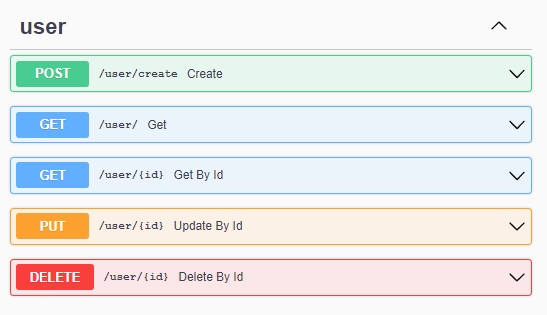

# Fast-API-user-example
## This is a simple CRUD route "User" which can be used for testing
- Get python libraries from requirements: `pip install requirements.txt`
- Change DATABASE_URL value in db_config.py
- Start server: `uvicorn main:app --reload`

## See documentation here:
To save openapi.json run `uvicorn main:app`

http://127.0.0.1:8000/docs

